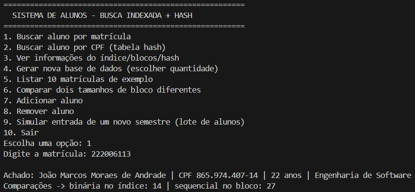
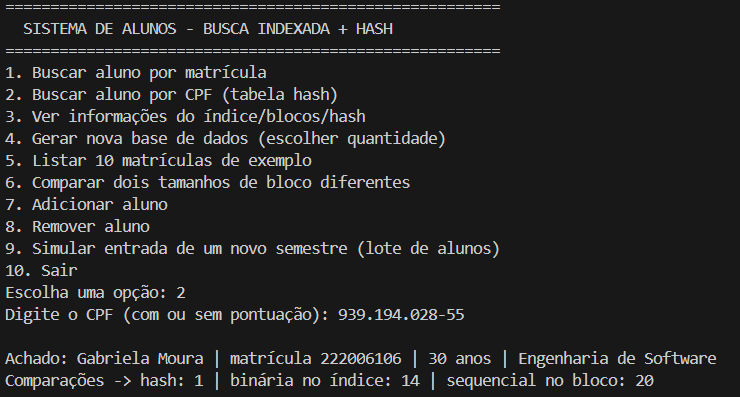
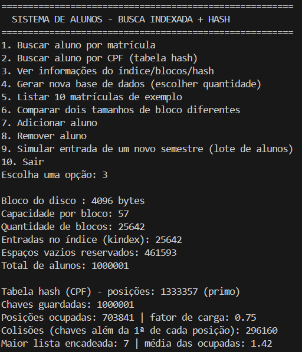

# G31_Busca_EDA2-2026.2
Repositório dedicado ao Trabalho 1 de Estruturas de Dados 2 do 2º semestre de 2026.

## Alunos  
| Matrícula | Nome |  
|-----------------------|---------------------|  
| 2X/XXXXXXX | ANA LUISA VIERIA NUNES |  
| 22/2006113 | JOÃO MARCOS MORAES DE ANDRADE |  

## Descrição do projeto

O projeto implementa um sistema de cadastro e busca de alunos combinando duas técnicas de Estruturas de Dados:

- **Busca sequencial indexada (kindex):** a base de alunos é ordenada por matrícula e dividida em blocos, com o mesmo tamanho do bloco de leitura do disco do computador (detectado automaticamente, geralmente 4096 bytes). Um índice (kindex) guarda só a primeira matrícula de cada bloco. Uma busca primeiro faz **busca binária** no kindex para achar o bloco certo, e depois **busca sequencial** só dentro daquele bloco — evitando percorrer a base inteira a cada consulta.
- **Espaço reservado nos blocos:** cada bloco nasce com uma parte vazia (30% de folga), permitindo inserir alunos novos direto no bloco certo sem precisar reordenar a base inteira toda vez. Só quando um bloco enche de verdade é que a estrutura é reconstruída.
- **Tabela hash por chave secundária (CPF):** além da matrícula (chave primária), cada aluno tem um CPF — gerado com dígitos verificadores válidos e único dentro da base — que funciona como **chave secundária**. A tabela hash tem tamanho primo e guarda pares `(CPF, matrícula)`, com **tratamento de colisão por encadeamento separado**: cada posição da tabela guarda uma lista, e as chaves que colidem entram nessa lista. Quando o fator de carga passa de 0.75, a tabela é refeita maior e as chaves são reespalhadas.
- **Busca por CPF:** o hash leva o CPF direto para a matrícula correspondente, e a matrícula entra no kindex (busca binária + sequencial no bloco) para chegar no registro completo. Guardar a matrícula em vez da posição física do registro faz o índice continuar válido mesmo depois dos blocos serem reorganizados.

O sistema permite cadastrar, buscar (por matrícula ou por CPF), remover e simular a entrada de novos alunos (ex: matrículas de um novo semestre), persistindo tudo em um arquivo CSV com as colunas `matricula`, `nome`, `cpf`, `idade`, `curso` e `telefone`.

### Comparação de desempenho

Medição feita sobre a base de 1.000.000 de alunos (blocos de 4096 bytes, 25.642 blocos, tabela hash com 1.333.357 posições e fator de carga 0.75), tirando a média de 5.000 buscas sorteadas:

| Etapa | Média de comparações |
|---|---|
| Hash (CPF → matrícula) | 1,38 |
| Busca binária no kindex | 14,73 |
| Busca sequencial dentro do bloco | 20,15 |

Ou seja: achar o aluno pelo CPF custa pouco mais de uma comparação na tabela hash, enquanto uma busca sequencial pura na base inteira precisaria percorrer, em média, 500.000 registros.

## Guia de instalação

### Dependências do projeto

- Python 3.10 ou superior
- Nenhuma biblioteca externa é necessária — o projeto usa apenas módulos padrão do Python (`csv`, `os`, `random`, `statistics`)

### Como executar o projeto

1. Clone este repositório:
   ```
   git clone https://github.com/<usuario>/G31_Busca_EDA2-2026.2.git
   cd G31_Busca_EDA2-2026.2
   ```
2. Execute o programa:
   ```
   python busca.py
   ```
   (no Windows, pode ser necessário usar `py busca.py`)
3. Um menu interativo será exibido no terminal, com as opções de busca, cadastro, remoção e simulação de novos semestres.

> Se o `alunos.csv` for de uma versão anterior (sem a coluna `cpf`), o programa detecta isso na abertura, sorteia um CPF válido e único para cada aluno e regrava o arquivo automaticamente.

## Vídeo de apresentação

- Vídeo do João Marcos apresentado o projeto:
[Assista no YouTube](https://youtu.be/oMpkMEHiAoY)

- Vídeo da Ana Luiza apresentado o projeto:
[Assista no YouTube](https://youtu.be/)


## Capturas de tela






## Conclusões

O trabalho uniu três técnicas de Estruturas de Dados: busca sequencial indexada (kindex + busca binária + busca sequencial em blocos), espaço reservado nos blocos para inserção sem reorganização total, e tabela hash com encadeamento para a chave secundária (CPF).
 
O que funcionou melhor foi a diferença de escala entre as técnicas, visível na comparação de desempenho: na base de 1.000.000 de alunos, uma busca sequencial pura levaria em média 500.000 comparações; a busca indexada resolve em ~35; e a busca por CPF via hash, em pouco mais de 1.
 
Principais dificuldades: detectar o tamanho de bloco do disco de forma confiável no Windows (sem `os.statvfs`, foi preciso usar `ctypes`), manter o kindex atualizado após inserções/remoções, calibrar os fatores de espaço reservado (30%) e de carga do hash (75%), e gerar CPFs válidos com dígito verificador correto.
 
No fim, o sistema ficou funcional de ponta a ponta: cadastro, busca por matrícula e por CPF, remoção e simulação de entrada de novos semestres, tudo persistido em CSV.

## Referências

- Material e slides da disciplina de Estruturas de Dados 2 (EDA2)
- Documentação oficial do Python: https://docs.python.org/3/